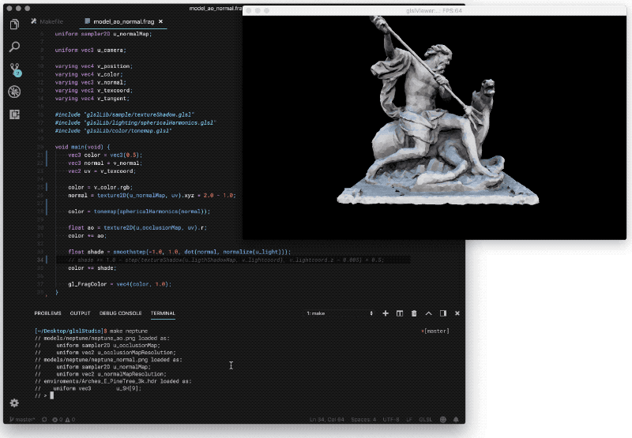
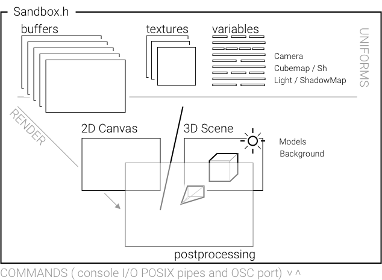
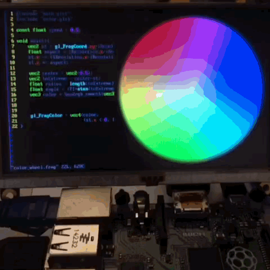

# glslViewer 

GlslViewer is a flexible console-base OpenGL Sandbox to display 2D/3D GLSL shaders without the need of an UI. You can definitely make your own UI or wrapper using the Python Module (include) or any other tool that communicates back/forth with glslViewer thought the standard POSIX console In/Out.

GlslViewer support both 2D shaders and/or 3D shaders when a geometry (PLY/OBJ) is provided.

GlslViewer gives support to:

* fragment and vertex shaders on GLSL 120 (compatible with WebGL 1.0 and OpenGL ES 2.0)
* resolve `#include` dependencies
* adding/deleting `#defines`, plus a rich set of automatically generated set of defines.
* adding/deleting uniforms (float, int, vec2, vec3 and vec4)
* import of Textures
* import of Cubemaps and spherical harmonics
* import PLY/OBJ (with materials)
* default vert/frag shaders with PBR lighting model
* hot reload of files on changes
* One default light and one default camera
* Interactive commands thought POSIX console IN/OUT
* headless rendering and image export
* PNG sequence export

## Wiki themes

* [**Installing** GlslViewer](https://github.com/patriciogonzalezvivo/glslViewer/wiki/Installing-GlslViewer)

* [**Using** GlslViewer](https://github.com/patriciogonzalezvivo/glslViewer/wiki/Using-GlslViewer)

* **Conventions**: over all GlslViewer is designed to be flexible, that means that sticks very close to GLSL language. There is not extra languages or meta data on top. The only conventions comes on the native uniform names and defines GlslViewer use to send information like time, resolution, lights, vertex attributes, material properties, platform type, shadowmap name, etc.

    * [UNIFORMS](https://github.com/patriciogonzalezvivo/glslViewer/wiki/GlslViewer-UNIFORMS)

    * [DEFINES](https://github.com/patriciogonzalezvivo/glslViewer/wiki/GlslViewer-DEFINES)

* [Python wrapper for GlslViewer](https://github.com/patriciogonzalezvivo/glslViewer/wiki/Python-wrapper-for-GlslViewer)

## TODO Features

[ ] Option for SSAO buffer ( `u_sceneSSAO` )

[ ] Add OSC compatibility

## Bugs to fix

[ ] [Support for GL (Full KMS) or GL (Fake KMS) on RaspberryPi](https://github.com/patriciogonzalezvivo/glslViewer/issues/135)

[ ] Depth frag shader for scene depthmap  ( `u_sceneDepth` ) instead of rendering to multiple targets ( only on RPI )

[ ] Depth frag shader for light's shadowMap, to work on RPI

## Author

[Patricio Gonzalez Vivo](https://twitter.com/patriciogv): [github](https://github.com/patriciogonzalezvivo) | [twitter](https://twitter.com/patriciogv) | [instagram](https://www.instagram.com/patriciogonzalezvivo/) | [website](http://patricio.io)

## Acknowledgements

Thanks to:

* [Mihai Sebea](https://twitter.com/mihai_sebea) for making the Windows compile happen

* [Karim Naaki](http://karim.naaji.fr/) lot of concept and code was inspired by this two projects: [fragTool](https://github.com/karimnaaji/fragtool) and [hdreffects](https://github.com/karimnaaji/hdreffects)

* [Doug Moen](https://github.com/doug-moen) he help to add the compatibility to ShaderToy shaders and some RayMarching features were added for his integration with his project: [curv](https://github.com/doug-moen/curv).

* [Wray](https://twitter.com/wraybowling) implement the OSC listener feature, opening GlslViewer to an entire new ways of communicating and interacting with other apps, devices and ecosystems.

* [Yvan Sraka](https://github.com/yvan-sraka) for putting the code in shape and setting it up for TravisCI.

* [Andsz](http://andsz.de/) for Spherical Harmonics code from [Spherical Harmonics Playground](https://github.com/ands/spherical_harmonics_playground/)

* [Syoyo Fujita](syoyo.wordpress.com) for the work on [tinyobjloader v1.0.x](https://github.com/syoyo/tinyobjloader)

* [Morgan McGuire](https://casual-effects.com)'s for the OBJ models on [Computer Graphics Archive](https://casual-effects.com/data)

* [Philip Rideout](http://prideout.net/) and [Romain Guy](http://www.curious-creature.com/) general generosity to share their code and experience

* [Mihai Sebea](https://codepatcher.wordpress.com) for porting it to windows(TM) 

