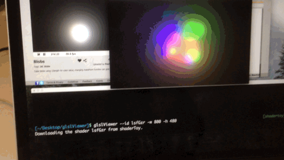

## glslViewer

Live-coding tool that renders GLSL Fragment shaders and update them every time they change and runs directly from the console of your RaspberryPi or MacOS. It handles for you the injection of sub-programs, textures and other uniforms such as time, resolution and mouse position. Is en essential a console version of [ShaderToy](https://www.shadertoy.com/)

### Installing in RaspberryPi

Install FreeImage libraries, download the code, compile and install.

```
sudo apt-get update
sudo apt-get upgrade
sudo apt-get install libfreeimage-dev libjsoncpp-dev libcurl3
cd ~ 
git clone http://github.com/patriciogonzalezvivo/glslViewer
cd glslViewer
make
make install
```

### Installing in Mac OSX

```
brew update
brew upgrade
brew install freeimage 
brew tap homebrew/versions
brew install glfw3 jsoncpp
cd ~ 
git clone http://github.com/patriciogonzalezvivo/glslViewer
cd glslViewer
make
make install
```

### Use

Run the app:

```
glslViewer test.frag
```

If you set alpha value to 0.3 (```glFragColor.a = 0.3;```) you can se through the console and from another terminal edit your shader with you favorite editor:

```
vim test.frag
```

In the test fragment shader we have hook it up to the X mouse position so you can take a look while you work on it.

Or you can login remotely using ssh to your raspberryPi and live-code with your favorite editor:

```
ssh pi@raspberrypi.local
vim test.frag
```

### Pre-Define Uniforms

Shaders are cross compatible with the webGL shaders from [ShaderToy](http://www.shadertoy.com) for that the following uniforms are pre-define and can be add to the shader with the ```-u``` argument

* ```u_time``` (```float```) or ```iGlobalTime``` (```float```) : shader playback time (in seconds)

* ```u_resolution``` (```vec2```) or ```iResolution``` (```vec3```): viewport resolution (in pixels)

* ```u_mouse``` (```vec2```) or ```iMouse``` (```vec4```): mouse pixel coords (xy: pos, zw: buttons)

* ```v_texcoord``` (```vec2```): UV of the billboard ( normalized )

### Dynamic uniforms: textures

You can load any image suported by FreeImage libraries, tehy will be load automatically and asign a uniform name acording to the order they are pass as arguments: ```u_tex0```, ```u_tex1```, etc. Together with that a resolution ```vec2``` uniform will be pass to: ```u_tex0Resolution```, ```u_tex1Resolution```, etc. 

```
glslViewer test.frag test.png
```

Also you can name texture uniforms as you want by assigning it to an argument before the image file For example, the ```uniform sampled2D iChannel;``` and  ```uniform vec2 iChannelResolution;``` is defined in this way:

```
glslViewer test.frag -iChannel test.png
```

### Others arguments

Beside for texture uniforms other arguments can be add to ```glslViewer``` to change it setup.

* ```-x [pixels]``` set the X position of the billboard on the screen

* ```-y [pixels]``` set the Y position of the billboard on the screen

* ```-w [pixels]``` or ```--width [pixels]```  set the width of the billboard

* ```-h [pixels]``` or ```--height [pixels]``` set the height of the billboard

* ```-s [seconds]``` exit app after a specific amount of seconds

* ```-o [filename]``` save the viewport to a image file before exit

* ```-d``` or ```--dither``` dither the image before exit

* ```-u``` add pre-defined uniforms to the top of the shader so that you can run [ShaderToy](https://www.shadertoy.com/) shader directly. 

* ```--squared``` to set a squared billboard

* ```-l``` or ```--live-coding``` to draw a 500x500 billboard on the top right corner of the screen that let you see the code and the shader at the same time

### Inject other files

You can include other GLSL code using a traditional ```#include “file.glsl”``` macro. Note: included files are not under watch so changes will not take effect until the main file is save.

## Authors

* [Patricio Gonzalez Vivo](http://patriciogonzalezvivo.com/)

* [Karim Naaji](https://github.com/karimnaaji/fragtool). 


